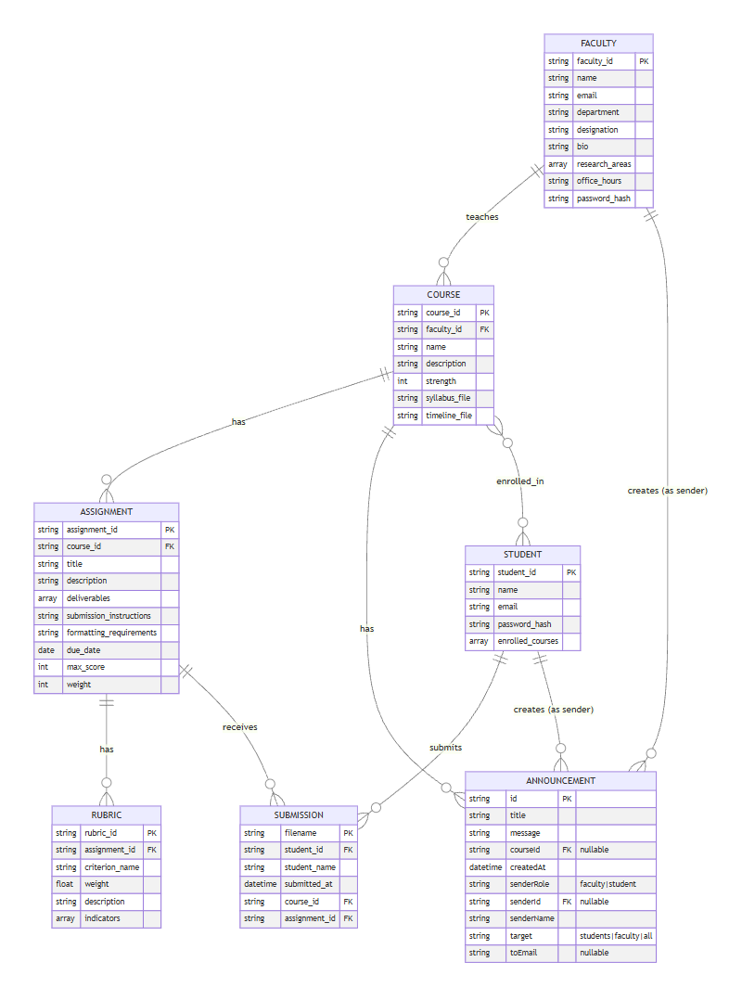

  <h1 class="section-title">Architecture & Data Design</h1>
  
  <h2 class="subsection-title">Enterprise Architecture</h2>
  
  

    
  

  
  

    <h3 class="subsubsection-title">Business Architecture</h3>
    <ul>
      <li>Differentiated workflows for admin, faculty, and students</li>
      <li>Assignment, submission, AI feedback, and communication workflows</li>
    </ul>
  

  
  

    <h3 class="subsubsection-title">Information System Architecture</h3>
    <ul>
      <li>Academic content flow</li>
      <li>AI integration layer</li>
      <li>Syllabus → AI Model → Feedback → Dashboard</li>
    </ul>
  

  
  

    <h3 class="subsubsection-title">Technology Architecture</h3>
    <ul>
      <li>Next.js, TypeScript, Tailwind, shadcn/ui</li>
      <li>Node.js/Next API endpoints</li>
      <li>Gemini API & LM Studio models</li>
    </ul>
  

  
  <h2 class="subsection-title">Entity Relationship Diagram (ERD)</h2>
  
  

    
  

  
  

    <h3 class="subsubsection-title">Entities</h3>
    <ul>
      <li>Admin</li>
      <li>Faculty</li>
      <li>Student</li>
      <li>Course</li>
      <li>Assignment</li>
      <li>Submission</li>
      <li>AI Feedback</li>
      <li>Communication Logs</li>
    </ul>
  

  
  <h2 class="subsection-title">Data Flow</h2>
  
  

    
  

  
  

    <h3 class="subsubsection-title">Data Flow Explanation</h3>
    <ol>
      <li>Admin creates faculty & course assignments</li>
      <li>Faculty uploads assignments</li>
      <li>Students submit PDFs</li>
      <li>System extracts text</li>
      <li>Gemini API analyzes submission</li>
      <li>AI feedback + faculty feedback saved</li>
      <li>Dashboard visualizes performance</li>
    </ol>
  

