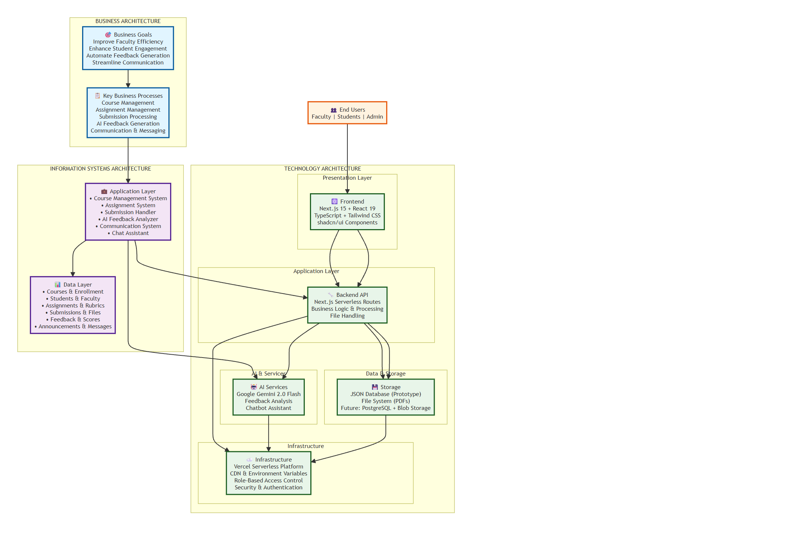

  <h1 class="section-title">Architecture & Data Design</h1>
  
  <h2 class="subsection-title">Entity Relationship Diagram (ERD)</h2>
  
  

    
  

  
  

    <h3 class="subsubsection-title">Overview</h3>
    
The ERD (Entity-Relationship Diagram) represents the <strong>database structure</strong> and data relationships for the Silver Leaf University Faculty & Student Portal. It shows how data is organized, stored, and connected within the system.

  

  
  

    <h3 class="subsubsection-title">Core Entities (8 Total)</h3>
    
    <h4>1. FACULTY</h4>
    
Represents faculty members who teach courses and manage assignments.

    
<strong>Key Attributes:</strong>

    <ul>
      <li><code>faculty_id</code> (Primary Key): Unique identifier</li>
      <li><code>name</code>, <code>email</code>, <code>department</code>, <code>designation</code></li>
      <li><code>bio</code>, <code>research_areas</code>, <code>office_hours</code></li>
      <li><code>password_hash</code>: Secure authentication</li>
    </ul>
    
<strong>Relationships:</strong>

    <ul>
      <li>Teaches multiple <strong>COURSE</strong>s (1-to-many)</li>
      <li>Creates <strong>ANNOUNCEMENT</strong>s (1-to-many)</li>
      <li>Generates/reviews <strong>FEEDBACK</strong> (1-to-many)</li>
    </ul>
    
    <h4>2. STUDENT</h4>
    
Represents students enrolled in courses.

    
<strong>Key Attributes:</strong>

    <ul>
      <li><code>student_id</code> (Primary Key): Unique identifier</li>
      <li><code>name</code>, <code>email</code></li>
      <li><code>password_hash</code>: Secure authentication</li>
      <li><code>enrolled_courses</code> (array): List of course IDs</li>
    </ul>
    
<strong>Relationships:</strong>

    <ul>
      <li>Enrolled in multiple <strong>COURSE</strong>s (many-to-many)</li>
      <li>Submits <strong>SUBMISSION</strong>s (1-to-many)</li>
      <li>Creates <strong>ANNOUNCEMENT</strong>s (1-to-many)</li>
      <li>Receives <strong>FEEDBACK</strong> (1-to-many)</li>
    </ul>
    
    <h4>3. COURSE</h4>
    
Represents academic courses offered at the university.

    
<strong>Key Attributes:</strong>

    <ul>
      <li><code>course_id</code> (Primary Key): Unique identifier</li>
      <li><code>faculty_id</code> (Foreign Key): Links to faculty teaching the course</li>
      <li><code>name</code>, <code>description</code></li>
      <li><code>strength</code>: Number of enrolled students</li>
      <li><code>syllabus_file</code>, <code>timeline_file</code>: File paths</li>
    </ul>
    
<strong>Relationships:</strong>

    <ul>
      <li>Taught by one <strong>FACULTY</strong> (many-to-1)</li>
      <li>Has multiple <strong>ASSIGNMENT</strong>s (1-to-many)</li>
      <li>Has multiple <strong>ANNOUNCEMENT</strong>s (1-to-many)</li>
      <li>Enrolls multiple <strong>STUDENT</strong>s (many-to-many)</li>
    </ul>
    
    <h4>4. ASSIGNMENT</h4>
    
Represents assignments created for courses.

    
<strong>Key Attributes:</strong>

    <ul>
      <li><code>assignment_id</code> (Primary Key): Unique identifier</li>
      <li><code>course_id</code> (Foreign Key): Links to parent course</li>
      <li><code>title</code>, <code>description</code></li>
      <li><code>deliverables</code> (array): Expected deliverables</li>
      <li><code>submission_instructions</code>, <code>formatting_requirements</code></li>
      <li><code>due_date</code>, <code>max_score</code>, <code>weight</code></li>
    </ul>
    
<strong>Relationships:</strong>

    <ul>
      <li>Belongs to one <strong>COURSE</strong> (many-to-1)</li>
      <li>Has multiple <strong>RUBRIC</strong>s (1-to-many)</li>
      <li>Receives multiple <strong>SUBMISSION</strong>s (1-to-many)</li>
      <li>Has multiple <strong>FEEDBACK</strong> records (1-to-many)</li>
    </ul>
    
    <h4>5. RUBRIC</h4>
    
Represents grading criteria for assignments.

    
<strong>Key Attributes:</strong>

    <ul>
      <li><code>rubric_id</code> (Primary Key): Unique identifier</li>
      <li><code>assignment_id</code> (Foreign Key): Links to assignment</li>
      <li><code>criterion_name</code>, <code>description</code></li>
      <li><code>weight</code> (float): Criterion importance</li>
      <li><code>indicators</code> (array): Evaluation indicators</li>
    </ul>
    
<strong>Relationships:</strong>

    <ul>
      <li>Belongs to one <strong>ASSIGNMENT</strong> (many-to-1)</li>
    </ul>
    
    <h4>6. SUBMISSION</h4>
    
Represents student submissions for assignments.

    
<strong>Key Attributes:</strong>

    <ul>
      <li><code>filename</code> (Primary Key): Unique file identifier</li>
      <li><code>student_id</code> (Foreign Key): Student who submitted</li>
      <li><code>student_name</code>: Redundant but useful for quick access</li>
      <li><code>submitted_at</code> (datetime): Submission timestamp</li>
      <li><code>course_id</code>, <code>assignment_id</code> (Foreign Keys): Context</li>
    </ul>
    
<strong>Relationships:</strong>

    <ul>
      <li>Submitted by one <strong>STUDENT</strong> (many-to-1)</li>
      <li>Belongs to one <strong>ASSIGNMENT</strong> (many-to-1)</li>
      <li>Belongs to one <strong>COURSE</strong> (many-to-1)</li>
      <li>Receives multiple <strong>FEEDBACK</strong> records (1-to-many)</li>
    </ul>
    
    <h4>7. ANNOUNCEMENT</h4>
    
Represents announcements and messages in the system.

    
<strong>Key Attributes:</strong>

    <ul>
      <li><code>id</code> (Primary Key): Unique identifier</li>
      <li><code>title</code>, <code>message</code>: Content</li>
      <li><code>courseId</code> (Foreign Key, nullable): Course-specific announcements</li>
      <li><code>createdAt</code> (datetime): Creation timestamp</li>
      <li><code>senderRole</code>: "faculty" or "student"</li>
      <li><code>senderId</code> (Foreign Key, nullable): Polymorphic reference</li>
      <li><code>senderName</code>, <code>target</code>, <code>toEmail</code></li>
    </ul>
    
<strong>Relationships:</strong>

    <ul>
      <li>Can be linked to a <strong>COURSE</strong> (many-to-1, optional)</li>
      <li>Created by <strong>FACULTY</strong> or <strong>STUDENT</strong> (polymorphic)</li>
    </ul>
    
    <h4>8. FEEDBACK</h4>
    
Represents AI-generated and faculty-reviewed feedback on submissions.

    
<strong>Key Attributes:</strong>

    <ul>
      <li><code>feedback_id</code> (Primary Key): Unique identifier</li>
      <li><code>submission_id</code>, <code>assignment_id</code>, <code>student_id</code> (Foreign Keys)</li>
      <li><code>faculty_id</code> (Foreign Key, nullable): Faculty reviewer</li>
      <li><code>score</code> (int): Numeric score (0-100)</li>
      <li><code>feedback_text</code>: Detailed feedback content</li>
      <li><code>strengths</code>, <code>improvements</code> (arrays): Structured feedback</li>
      <li><code>errors_marked</code> (int): Count of errors</li>
      <li><code>annotated_pdf_path</code> (nullable): Path to annotated PDF</li>
      <li><code>generated_at</code>, <code>reviewed_at</code> (datetime): Timestamps</li>
      <li><code>is_ai_generated</code>, <code>is_faculty_reviewed</code> (booleans): Flags</li>
    </ul>
    
<strong>Relationships:</strong>

    <ul>
      <li>Linked to one <strong>SUBMISSION</strong> (many-to-1)</li>
      <li>Linked to one <strong>ASSIGNMENT</strong> (many-to-1)</li>
      <li>Linked to one <strong>STUDENT</strong> (many-to-1)</li>
      <li>Reviewed by one <strong>FACULTY</strong> (many-to-1, optional)</li>
    </ul>
  

  
  

    <h3 class="subsubsection-title">Key Relationships Summary</h3>
    <ul>
      <li><strong>FACULTY → COURSE</strong> (1-to-many): One faculty teaches many courses</li>
      <li><strong>COURSE ↔ STUDENT</strong> (many-to-many): Students enroll in multiple courses</li>
      <li><strong>COURSE → ASSIGNMENT</strong> (1-to-many): One course has many assignments</li>
      <li><strong>ASSIGNMENT → RUBRIC</strong> (1-to-many): One assignment has many rubric criteria</li>
      <li><strong>ASSIGNMENT → SUBMISSION</strong> (1-to-many): One assignment receives many submissions</li>
      <li><strong>STUDENT → SUBMISSION</strong> (1-to-many): One student submits many assignments</li>
      <li><strong>SUBMISSION → FEEDBACK</strong> (1-to-many): One submission can have multiple feedback records</li>
      <li><strong>ASSIGNMENT → FEEDBACK</strong> (1-to-many): One assignment can have feedback for multiple students</li>
    </ul>
  

  
  <h2 class="subsection-title">Solution Architecture Diagram</h2>
  
  

    
  

  
  

    <h3 class="subsubsection-title">Overview</h3>
    
The Solution Architecture diagram shows <strong>how the system is built</strong> across three layers: Business, Information Systems, and Technology. It illustrates the flow from business goals to technical implementation.

  

  
  

    <h3 class="subsubsection-title">Layer 1: Business Architecture</h3>
    
    <h4>Business Goals (4 Objectives)</h4>
    <ol>
      <li><strong>Improve Faculty Efficiency</strong>
        <ul>
          <li>Reduce time spent on administrative tasks</li>
          <li>Streamline course and assignment management</li>
          <li>Automate repetitive processes</li>
        </ul>
      </li>
      <li><strong>Enhance Student Engagement</strong>
        <ul>
          <li>Provide easy access to course materials</li>
          <li>Enable seamless assignment submission</li>
          <li>Facilitate communication with faculty</li>
        </ul>
      </li>
      <li><strong>Automate Feedback Generation</strong>
        <ul>
          <li>Use AI to generate initial feedback</li>
          <li>Reduce faculty workload on grading</li>
          <li>Provide consistent, rubric-based evaluation</li>
        </ul>
      </li>
      <li><strong>Streamline Communication</strong>
        <ul>
          <li>Centralized announcement system</li>
          <li>Direct messaging between faculty and students</li>
          <li>Course-specific communication channels</li>
        </ul>
      </li>
    </ol>
    
    <h4>Key Business Processes (5 Core Processes)</h4>
    <ol>
      <li><strong>Course Management</strong>
        <ul>
          <li>Create and manage courses</li>
          <li>Upload syllabi and course materials</li>
          <li>Track enrollment</li>
        </ul>
      </li>
      <li><strong>Assignment Management</strong>
        <ul>
          <li>Create assignments with rubrics</li>
          <li>Set deadlines and requirements</li>
          <li>Track submission status</li>
        </ul>
      </li>
      <li><strong>Submission Processing</strong>
        <ul>
          <li>Accept student submissions (PDFs)</li>
          <li>Track submission status and deadlines</li>
          <li>Manage file storage</li>
        </ul>
      </li>
      <li><strong>AI Feedback Generation</strong>
        <ul>
          <li>Analyze submissions using AI</li>
          <li>Generate detailed feedback based on rubrics</li>
          <li>Create annotated PDFs for students</li>
        </ul>
      </li>
      <li><strong>Communication & Messaging</strong>
        <ul>
          <li>Post course announcements</li>
          <li>Enable faculty-student messaging</li>
          <li>Manage mail system</li>
        </ul>
      </li>
    </ol>
  

  
  

    <h3 class="subsubsection-title">Layer 2: Information Systems Architecture</h3>
    
    <h4>Data Layer (6 Core Data Types)</h4>
    <ol>
      <li><strong>Courses & Enrollment</strong>
        <ul>
          <li>Course information</li>
          <li>Student enrollment records</li>
          <li>Course-faculty associations</li>
        </ul>
      </li>
      <li><strong>Students & Faculty</strong>
        <ul>
          <li>User profiles and credentials</li>
          <li>Department and designation info</li>
          <li>Authentication data</li>
        </ul>
      </li>
      <li><strong>Assignments & Rubrics</strong>
        <ul>
          <li>Assignment details and requirements</li>
          <li>Rubric criteria and weights</li>
          <li>Grading guidelines</li>
        </ul>
      </li>
      <li><strong>Submissions & Files</strong>
        <ul>
          <li>Student submission files (PDFs)</li>
          <li>Submission metadata</li>
          <li>File storage paths</li>
        </ul>
      </li>
      <li><strong>Feedback & Scores</strong>
        <ul>
          <li>AI-generated feedback</li>
          <li>Faculty-reviewed feedback</li>
          <li>Scores and annotations</li>
        </ul>
      </li>
      <li><strong>Announcements & Messages</strong>
        <ul>
          <li>Course announcements</li>
          <li>Direct messages</li>
          <li>Communication logs</li>
        </ul>
      </li>
    </ol>
    
    <h4>Application Layer (6 Core Systems)</h4>
    <ol>
      <li><strong>Course Management System</strong>
        <ul>
          <li>CRUD operations for courses</li>
          <li>Enrollment management</li>
          <li>Syllabus management</li>
        </ul>
      </li>
      <li><strong>Assignment System</strong>
        <ul>
          <li>Assignment creation and editing</li>
          <li>Rubric management</li>
          <li>Deadline tracking</li>
        </ul>
      </li>
      <li><strong>Submission Handler</strong>
        <ul>
          <li>File upload processing</li>
          <li>Submission status tracking</li>
          <li>PDF processing and storage</li>
        </ul>
      </li>
      <li><strong>AI Feedback Analyzer</strong>
        <ul>
          <li>Integration with Gemini AI</li>
          <li>Batch processing of submissions</li>
          <li>Feedback generation and PDF annotation</li>
        </ul>
      </li>
      <li><strong>Communication System</strong>
        <ul>
          <li>Announcement posting</li>
          <li>Message routing</li>
          <li>Notification management</li>
        </ul>
      </li>
      <li><strong>Chat Assistant</strong>
        <ul>
          <li>Course-aware chatbot</li>
          <li>Faculty support queries</li>
          <li>Context management</li>
        </ul>
      </li>
    </ol>
  

  
  

    <h3 class="subsubsection-title">Layer 3: Technology Architecture</h3>
    
    <h4>Presentation Layer (Frontend)</h4>
    <ul>
      <li><strong>Framework</strong>: Next.js 15 (App Router)</li>
      <li><strong>UI Library</strong>: React 19 with TypeScript</li>
      <li><strong>Styling</strong>: Tailwind CSS</li>
      <li><strong>Components</strong>: shadcn/ui component library</li>
      <li><strong>Purpose</strong>: User interface and user interactions</li>
    </ul>
    
    <h4>Application Layer (Backend)</h4>
    <ul>
      <li><strong>API Framework</strong>: Next.js Serverless Routes</li>
      <li><strong>Business Logic</strong>: Core application processing</li>
      <li><strong>File Handling</strong>: PDF processing and file management</li>
      <li><strong>Purpose</strong>: Server-side logic and API endpoints</li>
    </ul>
    
    <h4>AI & Services</h4>
    <ul>
      <li><strong>AI Service</strong>: Google Gemini 2.0 Flash</li>
      <li><strong>Capabilities</strong>:
        <ul>
          <li>Feedback analysis and generation</li>
          <li>Chatbot assistant functionality</li>
          <li>Natural language processing</li>
        </ul>
      </li>
      <li><strong>Purpose</strong>: AI-powered features for feedback and assistance</li>
    </ul>
    
    <h4>Data & Storage</h4>
    <ul>
      <li><strong>Current (Prototype)</strong>:
        <ul>
          <li>JSON files for structured data</li>
          <li>File system for PDFs and documents</li>
        </ul>
      </li>
      <li><strong>Future (Production)</strong>:
        <ul>
          <li>PostgreSQL database for structured data</li>
          <li>Blob storage (Vercel Blob/S3) for files</li>
        </ul>
      </li>
      <li><strong>Purpose</strong>: Data persistence and file storage</li>
    </ul>
    
    <h4>Infrastructure</h4>
    <ul>
      <li><strong>Platform</strong>: Vercel Serverless Platform</li>
      <li><strong>CDN</strong>: Content delivery network</li>
      <li><strong>Security</strong>:
        <ul>
          <li>Role-Based Access Control (RBAC)</li>
          <li>Password hashing (SHA-256)</li>
          <li>API key protection via environment variables</li>
        </ul>
      </li>
      <li><strong>Purpose</strong>: Hosting, security, and scalability</li>
    </ul>
  

  
  <h2 class="subsection-title">Data Flow</h2>
  
  

    
  

  
  

    <h3 class="subsubsection-title">Data Flow Explanation</h3>
    
The data flows through the system as follows:

    <pre>
End Users (Faculty/Students/Admin)
    ↓
Presentation Layer (Next.js + React)
    ↓
Application Layer (API Routes + Business Logic)
    ↓
    ├─→ AI & Services (Gemini AI)
    ├─→ Data & Storage (JSON + Files)
    └─→ Infrastructure (Vercel + Security)
    </pre>
  

  
  <h2 class="subsection-title">How They Connect</h2>
  
  

    <h3 class="subsubsection-title">ERD ↔ Solution Architecture Relationship</h3>
    
    <h4>1. ERD Data Entities → IS Architecture Data Layer</h4>
    <ul>
      <li>The 8 ERD entities directly map to the 6 data types in the IS Architecture</li>
      <li>ERD shows <strong>structure</strong> (how data is organized)</li>
      <li>IS Architecture shows <strong>functionality</strong> (how data is used)</li>
    </ul>
    
    <h4>2. ERD Relationships → Application Systems</h4>
    <ul>
      <li>ERD relationships (e.g., FACULTY teaches COURSE) inform the Course Management System</li>
      <li>SUBMISSION → FEEDBACK relationship drives the AI Feedback Analyzer</li>
      <li>Many-to-many relationships (COURSE ↔ STUDENT) require enrollment management logic</li>
    </ul>
    
    <h4>3. ERD Attributes → Technology Implementation</h4>
    <ul>
      <li>Foreign keys in ERD become database relationships in Technology layer</li>
      <li>Arrays (enrolled_courses, deliverables) inform data structure choices</li>
      <li>File paths (syllabus_file, annotated_pdf_path) map to Storage layer</li>
    </ul>
    
    <h4>Example: Complete Flow</h4>
    
<strong>Scenario</strong>: Student submits assignment and receives AI feedback

    <ol>
      <li><strong>Business Process</strong>: Submission Processing + AI Feedback Generation</li>
      <li><strong>IS Application</strong>: Submission Handler + AI Feedback Analyzer</li>
      <li><strong>ERD Entities</strong>: SUBMISSION (created) → FEEDBACK (generated)</li>
      <li><strong>Technology</strong>: 
        <ul>
          <li>Frontend: File upload form (React)</li>
          <li>Backend: API route processes upload (Next.js)</li>
          <li>Storage: File saved to file system</li>
          <li>AI: Gemini analyzes submission and generates feedback</li>
          <li>Database: FEEDBACK record created with links to SUBMISSION, ASSIGNMENT, STUDENT</li>
        </ul>
      </li>
    </ol>
  

  
  

    <h3 class="subsubsection-title">Key Design Principles</h3>
    <ol>
      <li><strong>Separation of Concerns</strong>
        <ul>
          <li>Business layer defines "what" and "why"</li>
          <li>IS layer defines "how" (functionality)</li>
          <li>Technology layer defines "with what" (tools)</li>
        </ul>
      </li>
      <li><strong>Scalability</strong>
        <ul>
          <li>Current prototype uses JSON files</li>
          <li>Architecture supports migration to PostgreSQL + Blob storage</li>
          <li>Serverless design enables horizontal scaling</li>
        </ul>
      </li>
      <li><strong>Security</strong>
        <ul>
          <li>Role-based access control at application level</li>
          <li>Password hashing at data level (ERD)</li>
          <li>API key protection at infrastructure level</li>
        </ul>
      </li>
      <li><strong>Maintainability</strong>
        <ul>
          <li>Clear layer separation</li>
          <li>Well-defined relationships (ERD)</li>
          <li>Modular application systems (IS Architecture)</li>
        </ul>
      </li>
    </ol>
  

  
  

    <h3 class="subsubsection-title">Summary</h3>
    <ul>
      <li><strong>ERD</strong>: Shows <strong>what data exists</strong> and <strong>how it's connected</strong> (database structure)</li>
      <li><strong>Solution Architecture</strong>: Shows <strong>how the system works</strong> across business, IS, and technology layers (system design)</li>
    </ul>
    
Together, they provide a complete picture:

    <ul>
      <li><strong>ERD</strong> = The foundation (data model)</li>
      <li><strong>Solution Architecture</strong> = The building (system architecture)</li>
    </ul>
    
Both diagrams are essential for understanding the complete system from data structure to business implementation.

  

