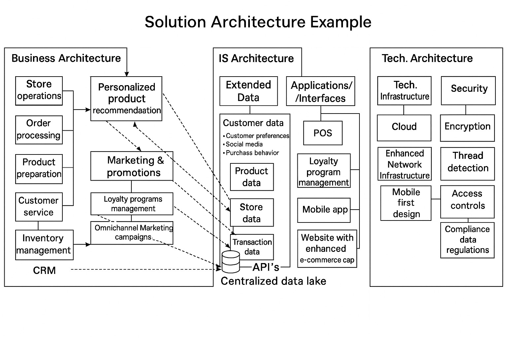
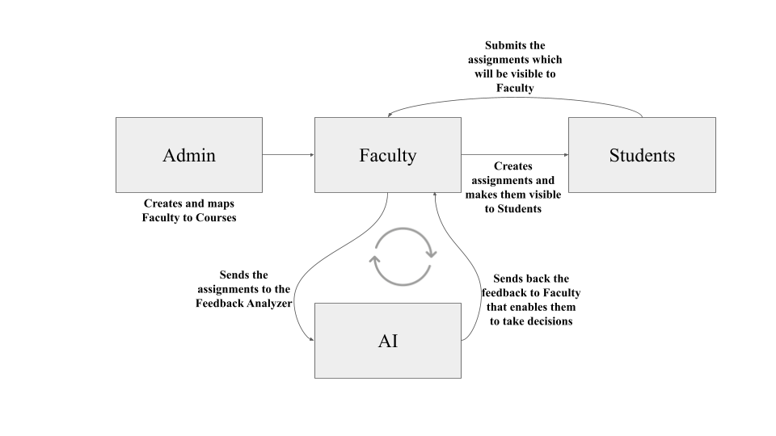
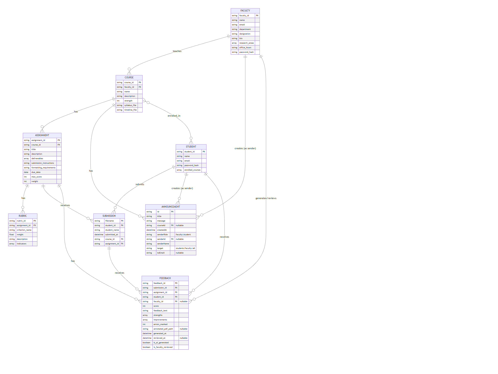

  

<h1 align="center" style="color:#003366; font-size: 36px; margin-bottom:0;">
  Silver Leaf University – Faculty & Student Portal
</h1>

  Team 4: Modern Research Pioneers

  Akshaya Cheruku • Gowri Bhavani Bommareddy • Krishna Chaitanya Bodepudi • Krishna Chaitanya Nizam • Sai Tulasi Akarapu

---

---

# Executive Summary

Silverleaf University is preparing for a major shift in how its faculty operate by introducing AI-powered tools and updated teaching technologies. As the Modern Research Pioneers (MRP) team, we focused on building a solution that helps faculty feel more confident using AI while also easing their workload. Our idea is a support portal that offers syllabus-aligned AI Faculty Support tools that assist with grading, class preparation, and quick academic assistance through a conversational AI trained specifically on Silverleaf University’s content.

Through research, system design analysis, and academic insight, our project aims to save faculty time, increase support efficiency, and help the university adopt a responsible, scalable, AI-ready academic ecosystem. The solution addresses operational challenges by aligning course design with AI models, delivering fast feedback to students, and providing faculty with structured and customizable AI support.

The system integrates the Gemini API for cloud-based AI and LM Studio for private local inference to ensure secure, policy-compliant usage. Our platform represents a modern and ethical approach to AI-powered academic support—balancing innovation, governance, transparency, and educational value.

---

# Problem Context & Stakeholder Perspectives

Faculty at Silverleaf University manage increasing academic expectations while navigating new teaching technologies. Many feel overwhelmed by administrative tasks, unclear workflows, and the lack of AI systems trained specifically on their syllabi and course structures. Students require consistent guidance, timely feedback, and structured academic support. Administrators must manage compliance, content governance, and institutional AI adoption.

Universities are also under pressure to modernize digital infrastructure, deliver AI-enabled learning experiences, and maintain competitive academic programs while ensuring responsible governance.

## Stakeholders

### Faculty
- Require support with grading, feedback, example generation  
- Need syllabus-aligned academic AI tools  
- Want faster ways to handle content-heavy tasks  

### Students
- Expect quick feedback  
- Need clarity on assignments and course structure  
- Benefit from consistent academic support  

### Administrators
- Oversee course-to-faculty mapping  
- Maintain oversight of academic operations  
- Ensure compliance and policy governance  

---

# Research & Insights

Our research used EDUCAUSE, Gartner, Ithaka S+R studies, and Deloitte’s AI in Education reports. Key findings:

- Students increasingly depend on AI for study assistance  
- Automated feedback saves faculty significant time  
- Universities must ensure governance, explainability, and policy alignment  
- Ethical issues include data privacy, bias mitigation, and transparency  
- Conversational AI can support learning if aligned with curriculum  
- Academic institutions prefer internal or private AI models for security  

We examined market tools like Cognigy and Kore.ai to understand workflow automation, but our academic problem required a custom-built syllabus-aligned system.

---

# Proposed Solution

The **AI Faculty Support Portal** is a centralized solution that assists faculty, students, and administrators with teaching workflows, academic communication, AI-based learning support, and grading assistance.

### Core Components

#### **1. Course-Aligned AI Assistant**
AI chatbot trained on:
- Syllabi  
- Rubrics  
- Reading material  
- Course outcomes  

Supports:
- Class preparation  
- Example generation  
- Assignment guidance  
- Clarification of concepts  

#### **2. AI Feedback Analyzer**
- Uses Gemini API  
- Analyzes PDF submissions  
- Extracts context  
- Generates preliminary feedback  
- Helps faculty save grading time  

#### **3. Assignment Workflow System**
- Admin assigns courses to faculty  
- Faculty create assignments  
- Students upload PDF submissions  
- AI & faculty feedback stored in the portal  

#### **4. Secure, Compliant AI Infrastructure**
Supports:
- Local LM Studio (Llama models / Private inference)  
- Cloud Gemini API (High-power inference)  

---

# Enterprise Architecture

  

### Business Architecture
- Differentiated workflows for admin, faculty, and students  
- Assignment, submission, AI feedback, and communication workflows  

### Information System Architecture
- Academic content flow  
- AI integration layer  
- Syllabus → AI Model → Feedback → Dashboard  

### Technology Architecture
- Next.js, TypeScript, Tailwind, shadcn/ui  
- Node.js/Next API endpoints  
- Gemini API & LM Studio models  

---

# Data Design

  

### Data Flow
1. Admin creates faculty & course assignments  
2. Faculty uploads assignments  
3. Students submit PDFs  
4. System extracts text  
5. Gemini API analyzes submission  
6. AI feedback + faculty feedback saved  
7. Dashboard visualizes performance  

---

# Entity Relationship Diagram (ERD)

  

### Entities
- Admin  
- Faculty  
- Student  
- Course  
- Assignment  
- Submission  
- AI Feedback  
- Communication Logs  

---

## Dashboard & Data Analysis

Our dashboard is designed to give a quick, straightforward view of what’s happening inside each course. We didn’t overcomplicate it — the goal was to help faculty and students find the most important information without clicking through multiple screens.

### What You Can See on the Dashboard

- **Assignments Overview**  
  Faculty can see all assignments created for their courses at a glance.

- **Submission Status**  
  The dashboard shows how many students submitted, who is pending, and whether any submissions were late.

- **AI Feedback Visibility**  
  Whenever Gemini generates draft feedback for a PDF submission, faculty can quickly spot which assignments already have AI feedback and which ones still need review.

- **Student View**  
  Students get a clean timeline of:
  - Upcoming deadlines  
  - Past submissions  
  - Course announcements  
  - Feedback (AI + faculty review)

### Why the Dashboard Matters
Instead of jumping between emails, PDFs, or multiple URLs, everything related to a course is visible in one place. This saves time for faculty and reduces confusion for students.

### Live Portal (Vercel Deployment)
You can explore the working portal here:

🔗 **Live Prototype:**  
https://faculty-portal-mrp.vercel.app

This live link demonstrates the entire workflow — assignments, submissions, dashboard analytics, and the AI features we built into the platform.
# Ethical & Social Considerations

Ethical thinking was part of our project from the very beginning. Since we are using AI in an academic environment, we made sure our design respects fairness, privacy, and transparency at every stage.

### Bias Mitigation
All AI-generated feedback is reviewed by faculty before being shared with students. This keeps grading fair and prevents the AI from making decisions on its own.

### Transparency
Whenever AI assists in generating feedback or responses, the system makes it clear. Faculty always know which parts came from the model and which parts were added manually.

### Privacy Protection
To keep student data safe, we support running the AI locally using **LM Studio**, which ensures that submissions and text never leave the university’s environment. No external data sharing occurs during local execution.

### Accessibility
We kept the interface clean and straightforward so both faculty and students can use it comfortably, regardless of technical experience. The portal design supports inclusive access for different user needs.

### Compliance
The system design aligns with important academic and legal frameworks, including **FERPA**, **GDPR**, and Silver Leaf University’s internal AI policy. This ensures our solution remains responsible and institution-ready.

Overall, the portal incorporates fairness, accountability, and explainability into the way it works, making the use of AI supportive — not risky — in a real academic setting.
# Lessons Learned & Team Reflection

### Team Reflection

Throughout this semester, our team got hands-on experience with real AI product development — not just the technical side, but also the research, design, and ethical thinking that go into building an academic tool. We realized very early that supporting faculty with AI isn’t just about writing code. It requires trust, clear communication, and a design that respects how instructors actually work.

Working together helped us refine our ideas, test different approaches, and find a balance between what is innovative and what is actually practical. We also learned that good technology decisions come from understanding real user needs — not from following trends.

Overall, this project gave us a stronger appreciation for how AI can responsibly support higher education when it's designed carefully, transparently, and with the end users truly in mind.
# Appendix

### GitHub Repository

Here is the full codebase for our Master’s Research Project, including the frontend, backend, dataset files, and the AI integration workflow.

🔗 **GitHub Repository:**  
https://github.com/krishnachaitanyabodepudi/faculty-Portal-MRP

---

### Project Walkthrough Videos

Below are the two Loom videos that walk through the portal, the workflows, and the AI components. These videos show how the system works end-to-end, including assignment posting, student submissions, and the AI feedback flow.

#### **Project Walkthrough – Part 1**

<iframe 
  src="https://www.loom.com/embed/b6724a2f4ce4469192720fa2fe27cad9"
  width="100%" 
  height="400" 
  frameborder="0" 
  allowfullscreen>
</iframe>

  

#### **Project Walkthrough using LM STUDIO – Part 2**

<iframe 
  src="https://www.loom.com/embed/b394a6d672544c3781d50854da318dd9"
  width="100%" 
  height="400" 
  frameborder="0" 
  allowfullscreen>
</iframe>
